# Architecture

This document provides a comprehensive architectural deep-dive into MeshDrop's codebase, covering the layered design, dependency graph, design patterns, data flow, and state management strategy.

---

## Table of Contents

- [Layered Architecture](#layered-architecture)
- [Module Dependency Graph](#module-dependency-graph)
- [Design Patterns](#design-patterns)
- [State Management](#state-management)
- [Initialization Sequence](#initialization-sequence)
- [Data Flow Diagrams](#data-flow-diagrams)
- [Feature Modules](#feature-modules)

---

## Layered Architecture

MeshDrop is structured into four distinct layers, each with a well-defined responsibility:

```
┌──────────────────────────────────────────────────────────────────────────────┐
│                              UI Layer (lib/ui/)                             │
│                                                                              │
│   HomeScreen          DeviceListScreen       TransferScreen    SettingsScreen │
│   (send flow,         (pair flow,            (progress bars,   (preferences, │
│    incoming dialog)    confirmation code)      pause/cancel)     trust mgmt)  │
├──────────────────────────────────────────────────────────────────────────────┤
│                         State Layer (lib/state/)                             │
│                                                                              │
│   AppStateNotifier ─── composes ─── DeviceStateNotifier                      │
│         │                                │                                   │
│         └── composes ── TransferStateNotifier                                │
│                                                                              │
│   Providers:  initProvider · discoveryManagerProvider                         │
│               transferManagerProvider · appSettingsProvider                   │
│               trustedDeviceManagerProvider · loadTrustedDevicesProvider       │
├──────────────────────────────────────────────────────────────────────────────┤
│                       Features Layer (lib/features/)                         │
│                                                                              │
│   Discovery:    DeviceDiscoveryManager ← DiscoveryAdapter (abstract)         │
│                     ├── NsdAdapter (cross-platform, wraps `nsd` package)      │
│                     ├── BonjourAdapter (iOS, delegates to NsdAdapter)         │
│                     └── AvahiAdapter (Win/Linux, delegates to NsdAdapter)     │
│                                                                              │
│   Encryption:   CryptoManager (Ed25519, X25519, ChaCha20-Poly1305)           │
│                 EncryptionSession (per-transfer key + nonce lifecycle)        │
│                                                                              │
│   Pairing:      PairingSession (TCP handshake, confirmation code)            │
│                 PairingNetworkProtocol (wire format)                          │
│                 TrustedDeviceManager (persist/load/delete trusted devices)    │
│                 SecureStorage (abstract) ← FlutterSecureStorageImpl          │
│                                                                              │
│   Transfer:     FileTransferManager (TCP server + send flow)                 │
│                 TransferProtocol (wire format)                                │
│                 TransferQueue · TransferNotification · SocketReader           │
├──────────────────────────────────────────────────────────────────────────────┤
│                         Core Layer (lib/core/)                               │
│                                                                              │
│   AppInitializer        Bootstraps identity keys on first launch             │
│   AppSettings           Immutable settings model (download dir, chunk size)  │
└──────────────────────────────────────────────────────────────────────────────┘
```

### Layer Rules

1. **UI Layer** → may read State Layer (via `ref.watch`/`ref.read`). Never imports from Features directly, except for model types needed by dialogs (e.g., `TransferRequest`, `Device`).
2. **State Layer** → instantiates and owns Feature-layer objects. Wires Feature callbacks to Riverpod notifiers. This is the "glue" between the feature business logic and the reactive UI.
3. **Features Layer** → pure business logic. Has no Flutter widget dependencies. Communicates results via callbacks and return values. May depend on other Feature sub-modules (e.g., Transfer depends on Encryption and Discovery).
4. **Core Layer** → fundamental configuration and bootstrap. No dependencies on Feature or State layers.

---

## Module Dependency Graph

```mermaid
graph TD
    subgraph UI
        HS[HomeScreen]
        DLS[DeviceListScreen]
        TS[TransferScreen]
        SS[SettingsScreen]
    end

    subgraph State
        AS[AppStateNotifier]
        DS[DeviceStateNotifier]
        TRS[TransferStateNotifier]
        DP[discoveryManagerProvider]
        TMP[transferManagerProvider]
        ASP[appSettingsProvider]
        IP[initProvider]
        TDP[trustedDeviceManagerProvider]
    end

    subgraph Features
        DDM[DeviceDiscoveryManager]
        DA[DiscoveryAdapter]
        NSD[NsdAdapter]
        BA[BonjourAdapter]
        AA[AvahiAdapter]
        CM[CryptoManager]
        ES[EncryptionSession]
        PS[PairingSession]
        PNP[PairingNetworkProtocol]
        TD[TrustedDeviceManager]
        FTM[FileTransferManager]
        TP[TransferProtocol]
        TQ[TransferQueue]
        TN[TransferNotification]
        SR[SocketReader]
        SSt[SecureStorage]
        FSS[FlutterSecureStorageImpl]
    end

    subgraph Core
        AI[AppInitializer]
        ASet[AppSettings]
    end

    HS --> AS
    HS --> DP
    HS --> TMP
    HS --> IP
    DLS --> DS
    DLS --> PS
    TS --> TRS
    TS --> TMP
    SS --> ASP

    AS --> DS
    AS --> TRS
    DP --> DDM
    DP --> DS
    TMP --> FTM
    TMP --> TRS
    IP --> AI
    TDP --> TD

    DDM --> DA
    DA --> NSD
    BA --> NSD
    AA --> NSD
    FTM --> DDM
    FTM --> CM
    FTM --> TP
    FTM --> TQ
    FTM --> TN
    FTM --> SR
    PS --> CM
    PS --> PNP
    PS --> SSt
    TD --> SSt
    AI --> CM
    AI --> SSt
    SSt --> FSS
    CM --> ES
```



---

## Design Patterns

### Adapter Pattern — Device Discovery

The discovery subsystem uses the **Adapter Pattern** to abstract platform-specific mDNS implementations:

```
                  ┌─────────────────────┐
                  │ DeviceDiscoveryManager│
                  │                     │
                  │  uses ──────────────┤
                  └─────────┬───────────┘
                            │
                  ┌─────────▼───────────┐
                  │  DiscoveryAdapter    │  ← abstract interface
                  │  (abstract class)    │
                  └─────────┬───────────┘
                            │
            ┌───────────────┼───────────────┐
            │               │               │
   ┌────────▼──────┐ ┌─────▼──────┐ ┌──────▼──────┐
   │ BonjourAdapter │ │ NsdAdapter │ │ AvahiAdapter │
   │    (iOS)       │ │ (Android)  │ │ (Win/Linux)  │
   └───────┬────────┘ └────────────┘ └──────┬──────┘
           │         delegates to           │
           └────────────► NsdAdapter ◄──────┘
```

**Why**: Adding a new platform (e.g., macOS-native) requires only a new `DiscoveryAdapter` subclass. No changes to `DeviceDiscoveryManager` or any consumer code.

### Dependency Inversion — Secure Storage

```
PairingSession ──────┐
CryptoManager  ──────┤─── depends on ──→ SecureStorage (abstract interface)
TrustedDeviceManager ┘                          ▲
                                                │
                                    FlutterSecureStorageImpl (concrete)
                                    injected via Riverpod provider
```

The abstract `SecureStorage` interface defines four operations (`write`, `read`, `delete`, `containsKey`). The concrete implementation is injected at the provider level, making it trivial to substitute a mock for testing or a different backend for new platforms.

### Observer / Callback Pattern — Feature ↔ State Bridge

Feature-layer classes expose **callback hooks** rather than directly depending on Riverpod:

```dart
// In DeviceDiscoveryManager (features layer):
void Function(List<Device> devices)? onDevicesChanged;

// In discoveryManagerProvider (state layer):
manager.onDevicesChanged = (devices) {
  final notifier = ref.read(deviceStateProvider.notifier);
  for (final device in devices) {
    notifier.addDiscovered(device);
  }
};
```

This keeps the feature layer testable without Flutter/Riverpod dependencies while allowing the state layer to bridge events into the reactive widget tree.

### Composition — State Aggregation

`AppState` composes `DeviceState` and `TransferState` rather than inheriting from them:

```dart
class AppState {
  final DeviceState deviceState;
  final TransferState transferState;
  final EncryptionSession? encryptionSession;
  final bool isDiscovering;
}
```

The `AppStateNotifier` listens to the individual `DeviceStateNotifier` and `TransferStateNotifier` providers, keeping all state in sync without tight coupling.

---

## State Management

MeshDrop uses **Riverpod** with `StateNotifier` for state management. The provider hierarchy is:

```
appSettingsProvider (late, initialized before runApp)
    └── AppSettingsNotifier : StateNotifier<AppSettings>

initProvider : FutureProvider<void>
    ├── cryptoManagerProvider : Provider<CryptoManager>
    └── secureStorageProvider : Provider<SecureStorage>

deviceStateProvider : StateNotifierProvider<DeviceStateNotifier, DeviceState>

transferStateProvider : StateNotifierProvider<TransferStateNotifier, TransferState>

appStateProvider : StateNotifierProvider<AppStateNotifier, AppState>
    ├── listens → deviceStateProvider
    └── listens → transferStateProvider

discoveryManagerProvider : Provider<DeviceDiscoveryManager>
    └── writes → deviceStateProvider

transferManagerProvider : Provider<FileTransferManager>
    ├── watches → discoveryManagerProvider
    ├── watches → cryptoManagerProvider
    ├── reads → appSettingsProvider
    ├── listens → appSettingsProvider (download directory updates)
    └── writes → transferStateProvider

trustedDeviceManagerProvider : Provider<TrustedDeviceManager>
loadTrustedDevicesProvider : FutureProvider<void>
    └── writes → deviceStateProvider
```

### Provider Lifecycle

| Provider | Lifecycle | Description |
|---|---|---|
| `appSettingsProvider` | Global (late init) | Loaded from `SharedPreferences` in `main()` before `runApp()` |
| `initProvider` | Lazy (one-shot) | Fires on first `ref.watch` (typically from `HomeScreen`) |
| `discoveryManagerProvider` | Lazy | Created when `HomeScreen` watches it; starts mDNS advertising + browsing |
| `transferManagerProvider` | Lazy | Created when `HomeScreen` watches it; starts TCP receive server |
| `loadTrustedDevicesProvider` | Lazy (one-shot) | Loads paired devices from secure storage on first watch |

---

## Initialization Sequence

The app bootstrap follows this order:

```
main()
  │
  ├─ WidgetsFlutterBinding.ensureInitialized()
  │
  ├─ await initAppSettingsProvider()           ← loads settings from SharedPreferences
  │     └─ AppSettingsNotifier.load()
  │         └─ SharedPreferences.getString('meshdrop_app_settings')
  │         └─ fallback: getApplicationDocumentsDirectory()
  │
  └─ runApp(ProviderScope(child: MeshDropApp()))
       │
       └─ HomeScreen.build()
            │
            ├─ ref.watch(initProvider)          ← triggers ensureIdentityKeys()
            │     └─ AppInitializer.ensureIdentityKeys()
            │         ├─ SecureStorage.containsKey('identity_ed25519_private')
            │         └─ (if missing) CryptoManager.generateEd25519KeyPair()
            │                         → SecureStorage.write(private + public)
            │
            ├─ ref.watch(loadTrustedDevicesProvider) ← loads paired devices
            │     └─ TrustedDeviceManager.loadTrustedDevices()
            │         └─ DeviceStateNotifier.addPaired(...)
            │
            ├─ ref.watch(discoveryManagerProvider)   ← starts mDNS
            │     ├─ _makeAdapter() → platform-specific adapter
            │     ├─ manager.startAdvertising()
            │     └─ manager.startBrowsing()
            │
            └─ ref.watch(transferManagerProvider)    ← starts TCP server
                  ├─ FileTransferManager(...)
                  ├─ manager.onTransferUpdated = (entry) → TransferStateNotifier
                  └─ manager.startReceiveServer() → ServerSocket.bind(:58432)
```

---

## Data Flow Diagrams

### File Send Flow

```
User taps device → FilePicker → File selected
                                      │
              FileTransferManager.sendFile(file, target)
                      │
                      ├─ Generate ephemeral X25519 key pair
                      ├─ Socket.connect(target.ip, 58432)
                      ├─ TransferProtocol.sendRequest(header + public key)
                      ├─ TransferProtocol.readResponse(reader)
                      │     ├─ 0x00 → Rejected (cancel)
                      │     └─ 0x01 + 32-byte key → Accepted
                      ├─ CryptoManager.deriveSharedSecret()
                      ├─ CryptoManager.createSession(sharedSecret)
                      ├─ _chunkFile() → List<FileChunk>
                      │
                      └─ for each chunk:
                            ├─ check paused → wait loop if paused
                            ├─ CryptoManager.encrypt(chunk.data, session)
                            ├─ socket.add([4-byte length] + [encrypted data])
                            ├─ TransferQueue.updateProgress()
                            ├─ onTransferUpdated → TransferStateNotifier
                            └─ TransferNotification.showProgress()
```

### File Receive Flow

```
ServerSocket.listen(:58432) → incoming connection
        │
        ├─ TransferProtocol.readRequest(reader) → TransferRequest
        ├─ onIncomingRequest callback → UI shows Accept/Reject dialog
        │     ├─ Rejected → sendReject(0x00) → socket.destroy()
        │     └─ Accepted ↓
        ├─ Generate ephemeral X25519 key pair
        ├─ sendAccept(0x01 + our public key)
        ├─ CryptoManager.deriveSharedSecret()
        ├─ CryptoManager.createSession(sharedSecret)
        ├─ _resolveDestPath() → unique file path
        ├─ File.openWrite() → IOSink
        │
        └─ _receiveChunks() loop:
              ├─ reader.read(4) → chunk length
              ├─ reader.read(chunkLen) → encrypted bytes
              ├─ CryptoManager.decrypt() → plaintext
              ├─ sink.add(decrypted) → streamed to disk
              ├─ TransferQueue.updateProgress()
              └─ TransferNotification.showProgress()
```

### Device Pairing Flow

```
DeviceListScreen._onPairDevice(device)
        │
        ├─ PairingSession(cryptoManager, secureStorage)
        ├─ session.initiate(device)
        │     ├─ Generate X25519 key pair
        │     ├─ Socket.connect(device.ip, 58433)
        │     ├─ PairingNetworkProtocol.sendPublicKey(our key)
        │     └─ PairingNetworkProtocol.readPublicKey() → remote key
        │
        ├─ session.generateConfirmationCode()
        │     ├─ CryptoManager.deriveSharedSecret()
        │     └─ _deriveCode() → 6-digit string
        │
        ├─ Show _PairingConfirmDialog(code)
        │     ├─ Cancel → dispose session
        │     └─ Confirm ↓
        │
        └─ session.completePairing(device, deviceManager)
              ├─ TrustedDevice created
              ├─ SecureStorage.write('trusted_<id>', JSON)
              ├─ TrustedDeviceManager.registerDevice(id) → manifest update
              └─ DeviceStateNotifier.addPaired(trusted)
```

---

## Feature Modules

### Discovery Module (`lib/features/discovery/`)

**Purpose**: Automatically discover MeshDrop peers on the local network using mDNS/DNS-SD.

**Service Type**: `_meshdrop._tcp`
**Port**: 58432 (transfer) / 58433 (pairing)

The `DeviceDiscoveryManager` maintains an in-memory list of discovered `Device` objects and fires `onDevicesChanged` whenever the list changes. It delegates all platform-specific mDNS operations to a `DiscoveryAdapter`.

Each adapter publishes TXT records with `deviceId` and `platform` fields, enabling the receiver to identify the remote device and its platform type.

### Encryption Module (`lib/features/encryption/`)

**Purpose**: Provide all cryptographic operations: key generation, key exchange, symmetric encryption/decryption, and message signing.

**Algorithms**:
- **Ed25519**: Long-term identity signing (persists across sessions)
- **X25519**: Ephemeral Diffie–Hellman key exchange (fresh per pairing/transfer)
- **ChaCha20-Poly1305**: AEAD symmetric cipher for file chunk encryption

The `CryptoManager` is a stateful singleton that holds the Ed25519 signing key pair. `EncryptionSession` objects are short-lived, created per-transfer, and invalidated when the transfer completes.

### Pairing Module (`lib/features/pairing/`)

**Purpose**: Establish trust between two devices via authenticated key exchange.

The `PairingSession` orchestrates the full pairing handshake over TCP port 58433. Both sides generate ephemeral X25519 key pairs, exchange public keys using the `PairingNetworkProtocol` wire format, derive a shared secret, and produce a 6-digit confirmation code. The user visually verifies the code matches on both screens.

Upon confirmation, a `TrustedDevice` is created, serialized to JSON, and persisted in `SecureStorage`. The `TrustedDeviceManager` maintains a manifest of device IDs for enumeration.

### Transfer Module (`lib/features/transfer/`)

**Purpose**: Reliable, encrypted, chunked file transfer over TCP.

The `FileTransferManager` is the central orchestrator. It runs a `ServerSocket` on port 58432 to accept incoming transfers and provides `sendFile()` for outgoing transfers. Transfers use ephemeral ECDH key exchange (embedded in the protocol) to establish per-transfer encryption, even between unpaired devices.

Key implementation details:
- **Streaming to disk**: Received chunks are decrypted and written directly to the output file via `IOSink.add()`. No full-file buffering in memory.
- **Auto-rename**: Destination files are auto-renamed (e.g., `file (1).txt`) to avoid conflicts.
- **Pause/Resume**: The send loop checks a `_paused` set and enters a polling wait loop when a transfer is paused.
- **Transfer Queue**: An in-memory ordered list tracking all active transfers with status and progress.
